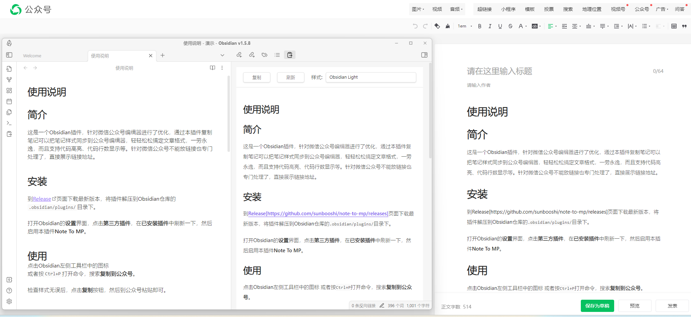

# ObsidianToMP

> 在 Obsidian 本地写作，一键复制到公众号编辑器，或一键同步到公众号草稿箱。  
> 重点解决本地图片上传痛点：支持配置 **S3 兼容图床**（如 Cloudflare R2 / MinIO / 兼容 S3 的对象存储）。

[](./plugin/LICENSE)
[](https://github.com/qianzhu18/ObsidianToMP/tree/stable)

## 为什么做这个项目
很多人用 Obsidian 写公众号，最大痛点有两个：
1. 复制粘贴后格式不稳定（尤其代码块、列表）。
2. 本地图片无法无门槛同步到云端，导致必须走公众号素材上传。

ObsidianToMP 的目标是做成一个 **体感良好、上手即用** 的本地插件：
- 不强制依赖付费服务
- 支持本地预览 + 复制 + 发草稿
- 支持你自己的云图床

## 主要能力（当前 stable）
- 公众号排版预览（Obsidian 内）
- 一键复制到公众号编辑器
- 一键同步到公众号草稿箱
- 多主题（含整合主题包）
- 多端预览切换（手机 / 平板 / 桌面）
- S3 兼容图床配置
- 复制时自动上传本地图片到云图床（在线图片自动跳过）
- 图床 URL Style（`auto/path/virtual-hosted`，兼容 OSS）

## 使用截图


## 安装到 Obsidian（零代码优先）

安装前准备（只需一次）：
1. 打开 Obsidian -> `设置` -> `第三方插件`
2. 关闭安全模式（Safe mode）

### 方式 A：BRAT 安装（纯图形界面，推荐）
1. `设置` -> `第三方插件` -> `社区插件`，搜索并安装 `BRAT`（你截图里的插件）。
2. 启用 `BRAT` 后，进入 `BRAT` 设置页。
3. 点击 `Add Beta Plugin`（或 `Add a beta plugin for testing`）。
4. 输入仓库：`qianzhu18/ObsidianToMP`（也可用完整 URL）。
5. 安装完成后，回到 `设置` -> `第三方插件`，启用 `ObsidianToMP`。
6. 在 BRAT 里执行一次 `Check for updates`，确认版本刷新。
7. 首次打开插件后，主题/高亮资源会自动下载；若网络较慢可在插件设置里手动点一次“下载”。

如果 BRAT 报错 `no manifest.json`，按下面排查：
1. 在 BRAT 设置里先删除这条失败安装记录。
2. 重启 Obsidian。
3. 重新 `Add Beta Plugin`，输入 `qianzhu18/ObsidianToMP`。
4. 如果还失败，直接走“方式 B（Release 手动安装）”。

### 方式 B：Release 手动安装（纯图形界面，最稳）
1. 打开发布页：`https://github.com/qianzhu18/ObsidianToMP/releases/tag/v1.0.0`
2. 下载 `obsidian-to-mp-v1.0.0.zip`。
3. 打开你的 Vault 目录，进入 `.obsidian/plugins/`。
4. 新建文件夹：`obsidian-to-mp`。
5. 把压缩包里的 3 个文件拖进去：
   - `main.js`
   - `styles.css`
   - `manifest.json`
6. 重启 Obsidian，进入 `设置` -> `第三方插件`，启用 `ObsidianToMP`。

常见路径示例：
- macOS：`<你的Vault路径>/.obsidian/plugins/obsidian-to-mp`
- Windows：`<你的Vault路径>\\.obsidian\\plugins\\obsidian-to-mp`

### 方式 C：源码开发安装（仅开发者）
普通用户不需要这一段。下面是终端命令，不是点击路径。
```bash
git clone https://github.com/qianzhu18/ObsidianToMP.git
cd ObsidianToMP
git checkout stable
cd plugin
npm install
npm run build
ln -sfn "/绝对路径/ObsidianToMP/plugin" "<你的Vault路径>/.obsidian/plugins/obsidian-to-mp"
```
然后在 Obsidian 启用 `ObsidianToMP`。

## 首发版本（v1.0.0）
- 计划发布标签：`v1.0.0`
- 下载地址（发布后可用）：`https://github.com/qianzhu18/ObsidianToMP/releases/tag/v1.0.0`
- Release 附件应包含 4 个文件：
  - `main.js`
  - `styles.css`
  - `manifest.json`
  - `assets.zip`（主题+高亮资源包）
- 本地已生成首发包：
  - `release/v1.0.0/obsidian-to-mp-v1.0.0.zip`

## 主题/高亮资源下载说明（外部账号）
- 插件会优先从 `latest` release 下载 `assets.zip`，并兼容 `v1.0.0 / 1.0.0` 两种标签格式。
- 如果提示“高亮资源未下载”或“外部主题资源未检测到”：
1. 进入插件设置，点击 `获取更多主题 -> 下载`。
2. 下载完成后重启预览页（关闭再打开“复制到公众号”视图）。
3. 若仍失败，浏览器直接打开并确认可下载：`https://github.com/qianzhu18/ObsidianToMP/releases/latest/download/assets.zip`
4. 公司网络受限时，建议切换网络后重试（移动热点通常可快速验证）。

## 云图床配置（S3 兼容）
在插件设置中填写：
- Endpoint
- Bucket
- Region（R2 可用 `auto`）
- URL Style（OSS 推荐 `virtual-hosted`，不确定时选 `auto`）
- AccessKey ID
- Secret Access Key
- Public Base URL（可选）
- Path Prefix（可选）

建议先点“测试上传”，成功后再正式使用。

## 使用方法（从 0 到可发布）
1. 在插件设置中填写公众号信息：
   - `公众号名称|AppID|AppSecret`（一行一个）
2. 点击 `测试公众号`：
   - 若提示 `IP 不在白名单`，把当前出口 IP 加到公众号后台白名单。
3. 如需图床，配置 S3 参数并点 `测试上传`。
4. 打开任意 Markdown 笔记，点击右侧 `复制到公众号`：
   - 本地图片会自动上传到图床
   - 已是在线链接的图片会自动跳过
5. 可选点击 `发文章` / `发图文`，一键保存到公众号草稿箱。

## 第二方测试清单（建议直接照测）
1. 安装验证：插件可启用，设置页能正常打开，版本号正确。
2. 渲染验证：标题、列表、代码块、引用、Callout 显示正常。
3. 复制验证：
   - 含本地图片：复制后公众号编辑器可见图片
   - 含在线图片：复制后不重复上传，图片可见
4. 发布验证：
   - `发文章` 成功进入公众号草稿箱
   - `发图文` 成功进入草稿箱
5. 异常验证：
   - 公众号白名单未配时，提示明确
   - 图床 ACL/403 时，错误提示可理解，链路有兜底行为

## Agent 一键写作链路（CLI + Skill + 插件）
目标：让 Agent 在本地自动完成「写作 -> 预览 -> 复制自动图床 -> 发布草稿」。

1. 使用 Claude Code / Codex CLI 执行写作任务，输出到 Obsidian 指定目录（`.md`）。
2. 将写作流程封装为可复用 Skill（提示词模板、标题结构、排版规则、发布前检查）。
3. 在 Obsidian 打开该稿件，使用 ObsidianToMP 做多端预览（手机/平板/桌面）。
4. 点击 `复制到公众号`，插件会自动上传本地图片并替换为云端链接（在线图片跳过）。
5. 选择：
   - 复制到公众号编辑器，或
   - 一键同步到微信公众号草稿箱。

### 推荐目录约定（便于 Agent 自动化）
- `content/inbox/`：Agent 初稿输出目录
- `content/review/`：人工校对目录
- `content/publish/`：待发布终稿目录

### 推荐自动化命令（示意）
```bash
# 1) 生成初稿（由你的 Agent/Skill 负责）
codex run "根据选题卡生成公众号稿件，写入 content/inbox/xxx.md"

# 2) 人工调整后在 Obsidian 中使用 ObsidianToMP 发布
# - 复制到公众号（自动处理图片）
# - 或直接发草稿
```

完整流程文档见：
- [agent/BMAD_OBSIDIAN_CLI_PLAYBOOK.md](./agent/BMAD_OBSIDIAN_CLI_PLAYBOOK.md)

## 分支策略（稳定可回退）
- `stable`：稳定可用版本，只接收验证过的修复。
- `main`：对外主线，周期性同步 `stable`。
- `codex/agent-exploration`：Agent 能力探索分支（CLI + Skill 集成实验）。

回退方式：
```bash
git checkout stable
```

## 研发路线（Road to 50 stars）
这是一个个人入门开源项目，目标是通过持续打磨拿到 50 stars：
- [x] 可用 MVP：预览、复制、发草稿
- [x] 图床能力：S3 兼容 + 自动上传兜底
- [ ] 复制保真回归集（列表/表格/Callout/代码块）
- [ ] 发布流程可观测（错误分层与排障文档）
- [ ] Demo Vault 与示例模板

欢迎提 Issue 与 PR，一起把这个项目做成 Obsidian 中文写作发布链路里的标准方案。

## 协议与致谢
- 本项目为 MIT 协议开源：见 [plugin/LICENSE](./plugin/LICENSE)
- 基于上游开源项目二次开发，保留了协议要求的版权与许可说明：见 [plugin/NOTICE](./plugin/NOTICE)
