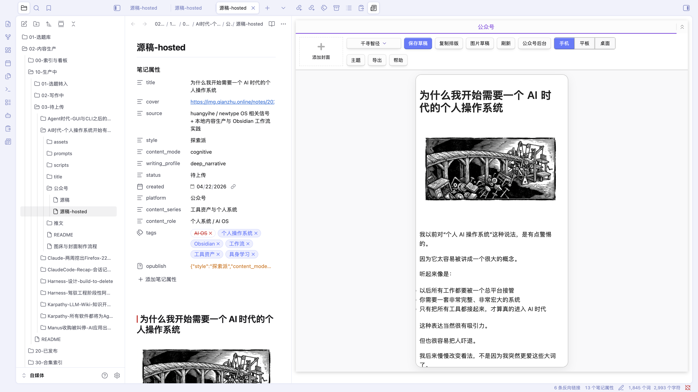

# ObsidianToMP

> Obsidian 原生的公众号内容生产与发布管理插件。  
> 把「写作、图床、主题、多机型预览、复制、保存草稿箱、Codex/Claude Code 交接」收在一个本地工作流里。

[](./plugin/LICENSE)
[](https://github.com/qianzhu18/ObsidianToMP/releases/latest)
[](https://github.com/qianzhu18/ObsidianToMP/tree/main)

## 为什么做这个项目
很多人已经在 Obsidian 里完成选题、资料、草稿和终稿，但公众号发布的最后一公里通常会断掉：

- 复制到公众号后，列表、代码块、引用和图片经常变形。
- 桌面预览看着还行，手机首屏、平板宽度、桌面宽屏不一定成立。
- 本地图片要么手动上传，要么临时换图床，流程很碎。
- Codex / Claude Code 已经能写稿，但写完还要人手动复制、上传、进草稿箱。
- 电脑端跑完以后，想在手机上继续编辑，往往卡在“草稿还没进公众号后台”。

ObsidianToMP 想解决的是这条链路：**在 Obsidian 里写完，让插件负责渲染、图床、预览和草稿箱交接，让人把精力留给内容本身。**

## 主要能力
- Obsidian 内公众号排版预览，不用先跳到网页编辑器。
- 手机 / 平板 / 桌面三种机型预览，重点检查首屏、图片比例、列表密度和长段落阅读感。
- 一键复制排版到公众号编辑器，尽量保持 Markdown 排版、代码高亮、引用和列表结构。
- 一键保存到微信公众号草稿箱，适合电脑端生成、手机端继续改。
- 图片草稿入口适合截图、海报、快讯类内容；普通长文建议走“保存草稿”。
- S3 兼容图床配置，支持 Cloudflare R2、MinIO、OSS 兼容 S3 等。
- 复制排版或保存草稿时自动处理本地图片；在线图片默认跳过，避免重复上传。
- 图床 URL Style 支持 `auto/path/virtual-hosted`，兼容常见对象存储。
- 多主题与代码高亮，支持内置主题、外部主题包和自定义 CSS 笔记。
- Codex / Claude Code 队列式交接：Agent 写稿后生成请求文件，ObsidianToMP 负责渲染并保存草稿箱。

## 创作发布工作台
插件当前围绕公众号最后一公里收束成五个模块：

- 图床设计与诊断：S3 兼容配置、URL Style 选择、测试上传、公网可读校验、ACL/403 错误提示。
- 主题选择：内置主题 + 外部主题包，支持默认样式、代码高亮、自定义 CSS 笔记。
- 多机型预览：手机、平板、桌面三种宽度一键切换，专门检查公众号阅读场景，而不是只看 Obsidian 编辑态。
- 公众号草稿箱：按公众号配置渲染正文、上传封面和图片，保存到草稿箱。
- Agent 联动：Codex / Claude Code 写稿后写入发布请求，插件按同一套主题、图床和公众号配置完成最后交接。

## 和参考产品有什么不同
这个项目参考过 NoteToMP、Raphael Publish、MWeb 主题资源和一些本地发布脚本，但现在的定位不同：它不是单纯的“复制工具”，也不是一个独立网页编辑器，而是 **Obsidian 里的公众号发布控制台**。

| 对比对象 | 它擅长什么 | ObsidianToMP 的差异 |
| --- | --- | --- |
| NoteToMP | Obsidian 复制到公众号、主题、代码高亮、基础保存草稿 | 保留 Obsidian 原生体验，同时强化本地图床、公开可读诊断、多机型预览、Agent 队列交接和 GitHub 一键安装产物 |
| Raphael Publish | 独立网页编辑器、漂亮主题、实时多端预览 | 不要求把内容搬出 Obsidian；更适合已经用 vault 管理选题、素材、草稿和发布队列的人 |
| MWeb themes | 主题资源丰富 | 主题只是其中一层；插件把主题、图床、公众号配置、草稿箱和 Agent 交接串成完整流程 |
| 本地 fullchain 脚本 | 适合生成封面、配图、hosted Markdown | 插件负责最后一公里：按 Obsidian 当前稿件渲染、预览、复制或保存到公众号草稿箱 |

## 为什么值得试
- 你已经用 Obsidian 管内容，不想为了发公众号再搬到另一个编辑器。
- 你希望发布前同时看手机、平板、桌面效果，减少“电脑看着好，手机读着累”的问题。
- 你有自己的图床，想让本地图片自动变成公网可读链接。
- 你希望 Codex / Claude Code 写完稿后，不只是生成 Markdown，而是能交给插件直接进公众号草稿箱。
- 你想保留人工最后编辑权：插件只保存草稿，不直接发布。

## 使用截图


上图是 Obsidian 内的发布工作台：左侧保留源稿，右侧完成主题、机型预览、复制排版、图片草稿和公众号草稿箱保存。

## 小白一键配置：把这段发给 Codex / Claude Code
如果你不想手动研究插件配置，可以把下面这一段直接复制给 Codex 或 Claude Code。它会先读取本仓库 README 和配套 skill，再帮你完成插件安装、写作目录初始化、Agent 发布队列配置和一次测试稿验证。

### 给 Codex 的提示词
```text
请帮我配置 ObsidianToMP 公众号发布工作流。

项目地址：https://github.com/qianzhu18/ObsidianToMP
配套 Codex skill：https://github.com/qianzhu18/ObsidianToMP/tree/main/agent/skills/obsidian-to-mp-agent

我的 Obsidian Vault 路径是：<填你的 Vault 绝对路径>
我的 Obsidian Vault 名称是：<填 Obsidian 左侧 vault 名称>

请你完成：
1. 阅读项目 README 和配套 skill。
2. 使用 skill-installer 安装配套 Codex skill，安装后提醒我重启 Codex。
3. 检查或安装 ObsidianToMP 插件到这个 Vault。
4. 初始化 content/inbox、content/review、content/publish、content/.obsidiantomp。
5. 引导我在 ObsidianToMP 设置页填写公众号和图床配置，不要在聊天里打印 AppSecret、S3 Secret。
6. 创建一篇测试稿，生成 publish-request.json。
7. 如果 Obsidian CLI 可用，触发 obsidian-to-mp:obsidian-to-mp-publish-queued-draft，并检查 publish-result.json。
8. 如果不能自动保存草稿，请明确告诉我卡在哪一步，以及我需要在 Obsidian 里点哪个按钮。
```

Codex 安装 skill 后需要重启一次，之后可以直接说：
```text
使用 $obsidian-to-mp-agent，根据这个选题写一篇公众号文章，保存到我的 Obsidian，并交给 ObsidianToMP 保存到公众号草稿箱：<你的选题>
```

### 给 Claude Code 的提示词
Claude Code 可以直接读取仓库链接和 `SKILL.md`。如果你的 Claude Code 没有类似 Codex 的 skill 安装器，就让它把这份 skill 当成项目说明执行。

```text
请帮我配置 ObsidianToMP 公众号发布工作流。

先读取：
1. https://github.com/qianzhu18/ObsidianToMP
2. https://raw.githubusercontent.com/qianzhu18/ObsidianToMP/main/agent/skills/obsidian-to-mp-agent/SKILL.md

我的 Obsidian Vault 路径是：<填你的 Vault 绝对路径>
我的 Obsidian Vault 名称是：<填 Obsidian 左侧 vault 名称>

请按 SKILL.md 的流程完成：
1. 检查或安装 ObsidianToMP 插件。
2. 初始化写作目录和发布队列。
3. 引导我填写公众号和图床配置，密钥只写入本地 Obsidian 插件配置，不要打印到聊天。
4. 生成一篇测试稿和 publish-request.json。
5. 尝试通过 Obsidian CLI 保存到公众号草稿箱，并读取 publish-result.json。
6. 如果我的环境不能自动触发，请生成一份可复制到 CLAUDE.md 的本地说明，让以后 Claude Code 知道怎么交接给 ObsidianToMP。
```

### 你需要提前准备的资料
- Obsidian Vault 路径和 Vault 名称。
- 公众号 `名称 / AppID / AppSecret`。
- 公众号后台 IP 白名单权限。
- 可选：S3 兼容图床信息，如 Cloudflare R2、MinIO、OSS 兼容 S3。
- 可选：默认封面图素材或公众号永久素材。

### Agent 最终会交付什么
- 插件安装或更新完成。
- 配套 skill 已安装，或 Claude Code 已读取同等说明。
- Vault 内生成 `content/inbox`、`content/review`、`content/publish`、`content/.obsidiantomp`。
- 终稿 Markdown 写入 `content/publish/`。
- 发布请求写入 `content/.obsidiantomp/publish-request.json`。
- 保存结果写入 `content/.obsidiantomp/publish-result.json`。

## 安装到 Obsidian（零代码优先）

安装前准备（只需一次）：
1. 打开 Obsidian -> `设置` -> `第三方插件`
2. 关闭安全模式（Safe mode）

### 方式 A：BRAT 安装（纯图形界面，推荐）
1. `设置` -> `第三方插件` -> `社区插件`，搜索并安装 `BRAT`（你截图里的插件）。
2. 启用 `BRAT` 后，进入 `BRAT` 设置页。
3. 点击 `Add Beta Plugin`（或 `Add a beta plugin for testing`）。
4. 输入仓库：`qianzhu18/ObsidianToMP`（也可用完整 URL）。
5. 安装完成后，回到 `设置` -> `第三方插件`，启用 `ObsidianToMP`。
6. 在 BRAT 里执行一次 `Check for updates`，确认版本刷新。
7. 首次打开插件后，主题/高亮资源会自动下载；若网络较慢可在插件设置里手动点一次“下载”。

仓库根目录已同步 `manifest.json`，Release 也会自动上传 `main.js / styles.css / manifest.json / assets.zip`，因此 BRAT 和手动安装走同一套产物。

如果 BRAT 报错 `no manifest.json`，按下面排查：
1. 在 BRAT 设置里先删除这条失败安装记录。
2. 重启 Obsidian。
3. 重新 `Add Beta Plugin`，输入 `qianzhu18/ObsidianToMP`。
4. 如果还失败，直接走“方式 B（Release 手动安装）”。

### 方式 B：Release 手动安装（纯图形界面，最稳）
1. 打开发布页：`https://github.com/qianzhu18/ObsidianToMP/releases/latest`
2. 下载最新的 `obsidian-to-mp-v版本号.zip`。
3. 打开你的 Vault 目录，进入 `.obsidian/plugins/`。
4. 新建文件夹：`obsidian-to-mp`。
5. 把压缩包里的 3 个文件拖进去：
   - `main.js`
   - `styles.css`
   - `manifest.json`
6. 重启 Obsidian，进入 `设置` -> `第三方插件`，启用 `ObsidianToMP`。

常见路径示例：
- macOS：`<你的Vault路径>/.obsidian/plugins/obsidian-to-mp`
- Windows：`<你的Vault路径>\\.obsidian\\plugins\\obsidian-to-mp`

### 方式 C：源码开发安装（仅开发者）
普通用户不需要这一段。下面是终端命令，不是点击路径。
```bash
git clone https://github.com/qianzhu18/ObsidianToMP.git
cd ObsidianToMP
git checkout main
cd plugin
npm install
npm run build
ln -sfn "/绝对路径/ObsidianToMP/plugin" "<你的Vault路径>/.obsidian/plugins/obsidian-to-mp"
```
然后在 Obsidian 启用 `ObsidianToMP`。

## 当前发布产物
- 当前插件版本：`v1.0.7`
- 下载地址：`https://github.com/qianzhu18/ObsidianToMP/releases/latest`
- Release 附件应包含：
  - `main.js`
  - `styles.css`
  - `manifest.json`
  - `assets.zip`（主题+高亮资源包）
  - `obsidian-to-mp-v版本号.zip`（手动安装包）

## 主题/高亮资源下载说明（外部账号）
- 插件会优先从 `latest` release 下载 `assets.zip`，并兼容 `v1.0.0 / 1.0.0` 两种标签格式。
- 如果提示“高亮资源未下载”或“外部主题资源未检测到”：
1. 进入插件设置，点击 `获取更多主题 -> 下载`。
2. 下载完成后重启发布工作台（关闭再打开“ObsidianToMP 发布工作台”视图）。
3. 如果资源目录已损坏或数量不完整，点击 `强制重下` 覆盖修复。
4. 若仍失败，浏览器直接打开并确认可下载：`https://github.com/qianzhu18/ObsidianToMP/releases/latest/download/assets.zip`
5. 公司网络受限时，建议切换网络后重试（移动热点通常可快速验证）。

## 云图床配置（S3 兼容）
在插件设置中填写：
- Endpoint
- Bucket
- Region（R2 可用 `auto`）
- URL Style（OSS 推荐 `virtual-hosted`，不确定时选 `auto`）
- AccessKey ID
- Secret Access Key
- Public Base URL（可选）
- Path Prefix（可选）

建议先点“测试上传”，成功后再正式使用。

## 使用方法（从 0 到可发布）
1. 在插件设置中填写公众号信息：
   - `公众号名称|AppID|AppSecret`（一行一个）
2. 点击 `测试公众号`：
   - 若提示 `IP 不在白名单`，把当前出口 IP 加到公众号后台白名单。
3. 如需图床，配置 S3 参数并点 `测试上传`。
4. 打开任意 Markdown 笔记，点击侧边栏报纸图标，进入 `ObsidianToMP 发布工作台`：
   - 本地图片会自动上传到图床
   - 已是在线链接的图片会自动跳过
5. 常用操作：
   - `复制排版`：把当前渲染结果复制到公众号编辑器
   - `保存草稿`：按公众号配置保存到微信公众号草稿箱
   - `图片草稿`：只适合截图、海报、快讯等图片型草稿，不是普通长文主流程

## Codex 一键保存到公众号草稿箱
适合“电脑端跑完 Codex，手机端继续最后编辑”的场景。

前提：
- Obsidian 桌面端正在运行
- Obsidian 已开启 CLI
- 当前 Vault 已启用 `ObsidianToMP`
- 插件设置里已保存公众号信息

Codex/Skill 写入请求文件：
```json
{
  "note": "content/publish/文章名.md",
  "account": "公众号名称或 wx 开头的 AppID",
  "resultPath": "content/.obsidiantomp/publish-result.json"
}
```

保存到：
```text
content/.obsidiantomp/publish-request.json
```

然后触发：
```bash
obsidian vault="<Vault名称>" command id="obsidian-to-mp:obsidian-to-mp-publish-queued-draft"
```

完成后检查 `content/.obsidiantomp/publish-result.json`：
- `ok: true`：已保存到公众号草稿箱，可在手机端继续编辑。
- `ok: false`：查看 `error`，常见是公众号 IP 白名单、封面缺失、图片上传或内容异常。

## 配套 Skill
本仓库自带一个可给 Agent 使用的 skill：

- Skill 目录：[`agent/skills/obsidian-to-mp-agent`](./agent/skills/obsidian-to-mp-agent)
- 原始 `SKILL.md`：`https://raw.githubusercontent.com/qianzhu18/ObsidianToMP/main/agent/skills/obsidian-to-mp-agent/SKILL.md`

它覆盖四类任务：
- 新手安装：检查 Vault、安装插件、启用插件、初始化目录。
- 内容创作：按公众号结构写 Markdown，放到 `content/inbox` 或 `content/publish`。
- 渲染交接：让 ObsidianToMP 做主题、代码高亮、机型预览和本地图片上传。
- 草稿箱保存：写入 `publish-request.json`，触发 Obsidian CLI，读取 `publish-result.json`。

Codex 用户可以直接让 Codex 安装：
```text
请用 skill-installer 从这个 GitHub 路径安装 skill：
https://github.com/qianzhu18/ObsidianToMP/tree/main/agent/skills/obsidian-to-mp-agent
安装完成后提醒我重启 Codex。
```

## 第二方测试清单（建议直接照测）
1. 安装验证：插件可启用，设置页能正常打开，版本号正确。
2. 渲染验证：标题、列表、代码块、引用、Callout 显示正常。
3. 复制验证：
   - 含本地图片：复制后公众号编辑器可见图片
   - 含在线图片：复制后不重复上传，图片可见
4. 草稿箱验证：
   - `保存草稿` 成功进入公众号草稿箱
   - `图片草稿` 对截图/海报型内容有明确提示，不误导为普通长文发布
5. 异常验证：
   - 公众号白名单未配时，提示明确
   - 图床 ACL/403 时，错误提示可理解，链路有兜底行为

## Agent 一键写作链路（CLI + Skill + 插件）
目标：让 Agent 在本地自动完成「写作 -> 预览 -> 复制自动图床 -> 保存草稿」。

1. 在 Obsidian 命令面板执行 `ObsidianToMP: 初始化公众号写作工作流`，生成 `content/inbox / content/review / content/publish` 与模板。
2. 使用 Claude Code / Codex CLI 执行写作任务，输出到 Obsidian 指定目录（`.md`）。
3. 将写作流程封装为可复用 Skill（提示词模板、标题结构、排版规则、发布前检查）。
4. 在 Obsidian 打开该稿件，使用 ObsidianToMP 做多端预览（手机/平板/桌面）。
5. 点击 `复制排版`，插件会自动上传本地图片并替换为云端链接（在线图片跳过）。
6. 如果要无人值守保存草稿，让 Agent 写入 `content/.obsidiantomp/publish-request.json` 并触发命令 `obsidian-to-mp:obsidian-to-mp-publish-queued-draft`。
7. 选择：
   - 复制排版到公众号编辑器，或
   - 保存到微信公众号草稿箱。

### 推荐目录约定（便于 Agent 自动化）
- `content/inbox/`：Agent 初稿输出目录
- `content/review/`：人工校对目录
- `content/publish/`：待发布终稿目录

### 推荐自动化命令（示意）
```bash
# 1) 生成初稿（由你的 Agent/Skill 负责）
codex run "根据选题卡生成公众号稿件，写入 content/inbox/xxx.md"

# 2) 人工调整后在 Obsidian 中使用 ObsidianToMP 交接
# - 复制排版（自动处理图片）
# - 或直接保存草稿
```

完整流程文档见：
- [agent/BMAD_OBSIDIAN_CLI_PLAYBOOK.md](./agent/BMAD_OBSIDIAN_CLI_PLAYBOOK.md)

## 分支策略（稳定可回退）
- `main`：对外主线，README、Release 和可安装产物都以它为准。
- `docs/*`：文档和新手上手流程。
- `feat/*`：功能开发分支，合并前通过构建和手动验证。
- `stable`：历史稳定分支，保留给需要旧版本回退的用户。

回退方式：
```bash
git fetch --tags
git checkout v1.0.6
```

## 研发路线（Road to 50 stars）
这是一个个人入门开源项目，目标是通过持续打磨拿到 50 stars：
- [x] 可用 MVP：预览、复制排版、保存草稿
- [x] 图床能力：S3 兼容 + 自动上传兜底
- [ ] 复制保真回归集（列表/表格/Callout/代码块）
- [ ] 发布流程可观测（错误分层与排障文档）
- [ ] Demo Vault 与示例模板

欢迎提 Issue 与 PR，一起把这个项目做成 Obsidian 中文写作发布链路里的标准方案。

## 协议与致谢
- 本项目为 MIT 协议开源：见 [plugin/LICENSE](./plugin/LICENSE)
- 基于上游开源项目二次开发，保留了协议要求的版权与许可说明：见 [plugin/NOTICE](./plugin/NOTICE)
